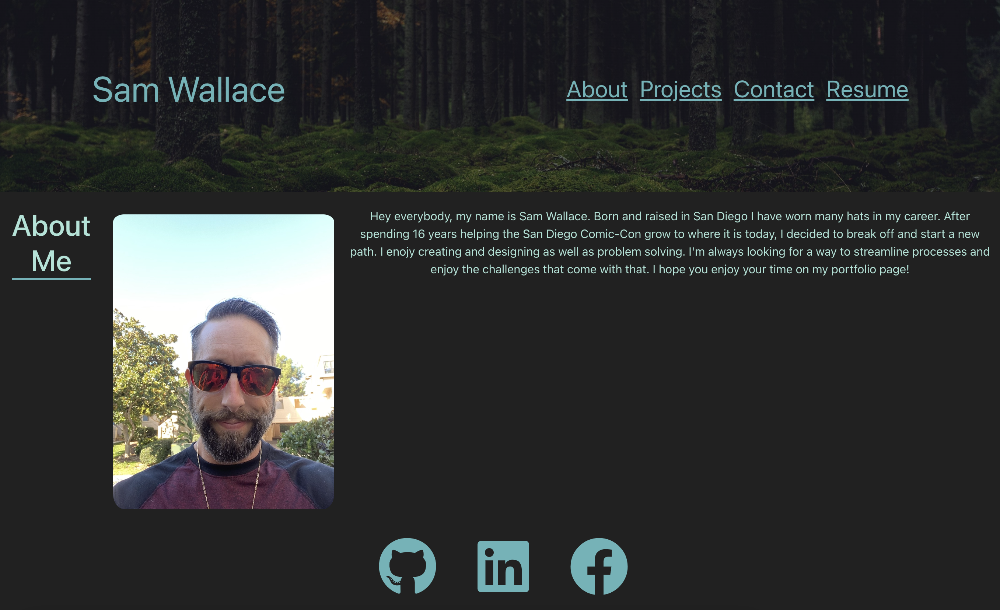

# Sam Wallace's Reacto Portfolium

## Description

You're a developer Sammy! Welcome to my reacto portfolium, which has been my first enjoyable experiment with React and React Bootstrap. Here you will find some examples of the projects I've built and contributed to, as well as a link to my resume. I felt motivated, throughout the process of building this project, because I have had a feeling that I want to focus on front-end development and I know that React is a Dumbledor in the wizarding world wizarding world that is web development. I hope you enjoy your magical visit, feel free to contact me with any questions!

This was a fun look into what React can offer and how flexible it can be. I am looking forward to further my skills with react and the many ways to make amazing components with it!

## Deployed Link

[Reacto Portfolium!](https://sammymayhem.github.io/reacto-portfolium-2/#/)

## Screenshot

## Credits

I'd like to thank John and Michael for spending time helping me hone things on my page, also for the time they will be spending even after this is submitted to hopefully help some more. Also credit to all the developers who put totorials on YouTube, those can go a long way for a lot of people!